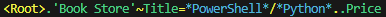

# Extended Dot Notation

**Xdn (Extended dot notation)** is an expression language designed to support the query or transformation of PowerShell Object-Graphs document similar to [**XPath**][1] for XML documents.
The XdnPath language is based on a tree representation of Object-Graph, and provides the ability to navigate around the tree and selecting nodes by a variety of criteria.
Extended dot notation helps you write simpler and shorter code for complex to handle complex Object-Graphs.

Throughout this document several examples are given that are based on the following Graph-Object:

```PowerShell
$ObjectGraph =
    @{
        BookStore = @(
            @{
                Book = @{
                    Title = 'Harry Potter'
                    Price = 29.99
                }
            },
            @{
                Book = @{
                    Title = 'Learning PowerShell'
                    Price = 39.95
                }
            }
        )
    }
```

## Native Dot Notation

Xdn might be used for the `path` parameter on the `Get-Node` cmdlet and is compatible with the native PowerShell dot notation.
This includes:

* Index selection by using an index number surrounded by square brackets as e.g.: `[3]` which selects the fourth item in a (zero based) array or list.
    - This also includes negative numbers (e.g. `[-1]`) that count from the end of the array or list.
* [Quoting rules][3]
* Selecting Members (properties) by their name (prefixed by a dot) as e.g.: `.Name`.
    - This also includes [Member-Access Enumeration][2], as e.g.:

```PowerShell
$ObjectGraph.BookStore.Book.Title
Harry Potter
Learning PowerShell
```

## Extended Dot Notation

Xdn supplies some extra features on top of the native PowerShell dot notation by adding support for:

* **Absolute** vs **relative** paths selections
* **Wildcards**, limited to question marks (`?`) and asterisks (`*`)
* A set of additional operators:
    - A **ancestor (`..`) selector** to select the parent node or an ancestor
    - A **descendant (`~`) selector** to select a (deep) descendant node
    - An **equals (`=`) filter** to select a (leaf) node with a specific value
    - A **Or (`/`) selection list** to represent a list of possible names or values


### Absolute vs relative paths selection

Any path that is preceded with a dot (`.`) is considered relative any other path is considered an absolute path with starts from the root node.

Examples of an absolute path:

* `[0].Book.Title`
* `BookStore.Book.Title`

Examples of an relative path:

* `.[1].Book.Title`
* `.Book.Title`

### Wildcard (`?` and `*`) selector

A wildcard character is a kind of placeholder represented by a single character.
Xdn recognizes the following wildcards:

* A question mark (`?`), which is a substitute for any single character
* An asterisk (`*`), which can be interpreted as a number of literal characters or an empty string

#### Example

Select all the node from the `Book` nodes:

```
$ObjectGraph | Get-Node BookStore.Book.*

PathName                Name  Depth               Value
--------                ----  -----               -----
BookStore[0].Book.Price Price     4               29.99
BookStore[0].Book.Title Title     4        Harry Potter
BookStore[1].Book.Price Price     4               39.95
BookStore[1].Book.Title Title     4 Learning PowerShell
```

### Ancestor (`..`) selector

Two or more consecutive dots represent the parent node or any higher ancestor.

#### Example

Select the title from the first book:

```PowerShell
$1stTitle  = $ObjectGraph | Get-Node BookStore[0].Book.Title
$1StTitle

PathName                Name  Depth Value
--------                ----  ----- -----
BookStore[0].Book.Title Title     4 Harry Potter
```

Select the parent node of the `$1StTitle` node:

```PowerShell
$1stTitle | Get-Node ..

PathName          Name Depth Value
--------          ---- ----- -----
BookStore[0].Book Book     3 {Price, Title}
```

> [!NOTE]
> Trying to select the parent (or an ancestor) node of the root node will result in a empty selection.

### Descendant (`~`) selector

A tilde character (`~`) might be used to select a (deep) descendant of the current node.

#### Example

Select all the descendant `title` nodes from the `BookStore` node:

```PowerShell
$ObjectGraph | Get-Node BookStore~Title

PathName                Name  Depth Value
--------                ----  ----- -----
BookStore[0].Book.Title Title     4 Harry Potter
BookStore[1].Book.Title Title     4 Learning PowerShell
```

> [!NOTE]
> The iteration will stop when the concerned descendant node is found.
> Meaning that it will not return any deeper descendant nodes with the same name.
> To retrieve *all* nodes with a specific name, use the `Get-ChildNode` cmdlet.

### Equals (`=`) filter

To select a node with a specific value, use equals sign (`=`).

#### Example

Select the price of the `PowerShell` book:

```PowerShell
($ObjectGraph | Get-Node BookStore~Title=*PowerShell*..Price).Value
39.95
```

**Explanation:**
* `BookStore` starting from the *BookStore* node
* `~Title` selects any descendant node named "*Title*"
* `*PowerShell*` filters all the nodes by values that contain s the word "*PowerShell*"
* `..` selects the parent of the resulted node (the first "*book*" node`)
* `Price` selects the "*Price*" node of the current "*book*" node
* `().Value` retrieves the actual **Value** property of the found node

Note that the `Value` property is a reference to the actual `Price` property in the Object-Graph,
which means you might simply change the price of the that book by assigning a new value:

#### Example

Change the price of the **PowerShell** book:

```PowerShell
($ObjectGraph | Get-Node BookStore~Title=*PowerShell*..Price).Value = 24.95
$ObjectGraph | ConvertTo-Expression
@{
    BookStore = @(
        @{
            Book = @{
                Price = 29.99
                Title = 'Harry Potter'
            }
        },
        @{
            Book = @{
                Price = 24.95
                Title = 'Learning PowerShell'
            }
        }
    )
}
```

### Or (`/`) selection list

A selection list, separated by a slash (`/`), might a used to filter a specific name or value based on a validation list:

#### Example

Select all the PowerShell and Python books:

```PowerShell
$ObjectGraph | Get-Node BookStore~Title=*PowerShell*/*Python*

PathName                Name  Depth Value
--------                ----  ----- -----
BookStore[1].Book.Title Title     4 Learning PowerShell
```

> [!NOTE]
> The `or` operator for a selection list might only be used for **member names** and **member values**.
> It can't be used between expressions as: <strike>`BookStore~Title=*PowerShell*/Comment=*Program*`</strike>

#### Literal

In general the Xdn operators or wildcard characters in quote-less parameters strings but in case any of these characters (or and any other PowerShell special characters as simple space character) is part of a literal name or value, you might either:

* Surround the name or value by (single or double) quotes, e.g.: `$ObjectGraph | Get-Node ~Title='Learning PowerShell'`
* Prefix the operator or wildcard with an PowerShell escape (backtick: `` ` ``), e.g. ``$ObjectGraph | Get-Node ~Values=3`~5``

## Debugging

To validate an Xdn Path, you might simply view the path using the `[XdnPath]` class:

```PowerShell
 [XdnPath]'"Book Store"~Title=*PowerShell*/*Python*..Price'
 ```



**Explanation:**

* A (fully) green path might be used for native dot notation.
  e.g.: `BookStore[0].Book.Title`: might be used directly on a PowerShell object: `$MyObject.BookStore[0].Book.Title`
* Parts with a different color than green can only be used on a object node (`PSNode` type):
  * The yellow parts are extended (**Xdn**) operators
  * The blue parts mark any names or values with wildcards
  * Any red part marks an error in the `XdnPath` expression meaning that the Xdn Path will likely fail on a `PSNode` instance

To Show the specific entries of the path, you might also use the `Entries` property:

```PowerShell
([XdnPath]'"Book Store"~Title=*PowerShell*/*Python*..Price').Entries

       Key Value
       --- -----
      Root
     Child 'Book Store'
Descendant Title
    Equals {*PowerShell*, *Python*}
  Ancestor 1
     Child Price
```

[1]: https://en.wikipedia.org/wiki/XPath "XPath (XML Path Language)"
[2]: https://learn.microsoft.com/en-us/powershell/module/microsoft.powershell.core/about/about_member-access_enumeration "Member-Access Enumeration"
[3]: https://learn.microsoft.com/en-us/powershell/module/microsoft.powershell.core/about/about_quoting_rules "Quoting Rules"